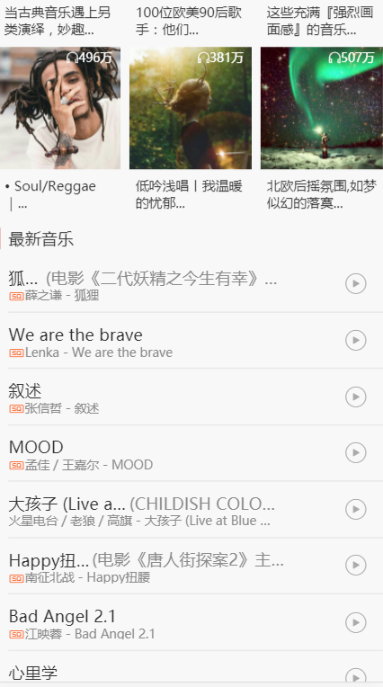
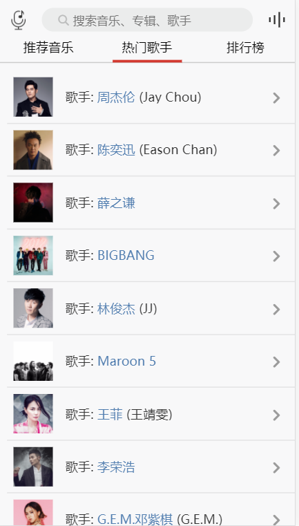
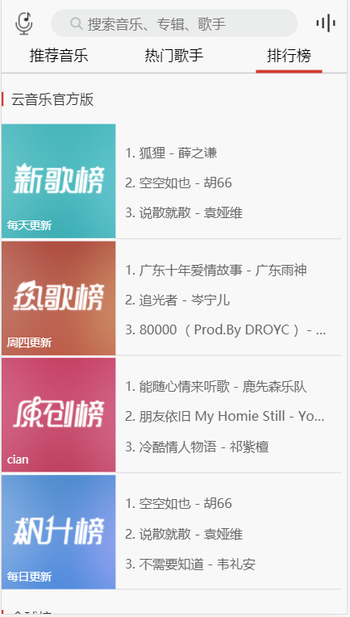
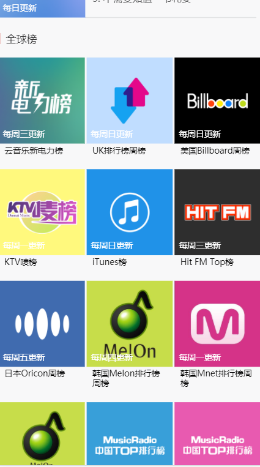
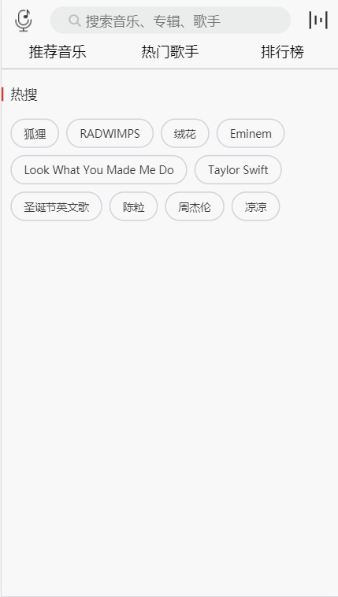
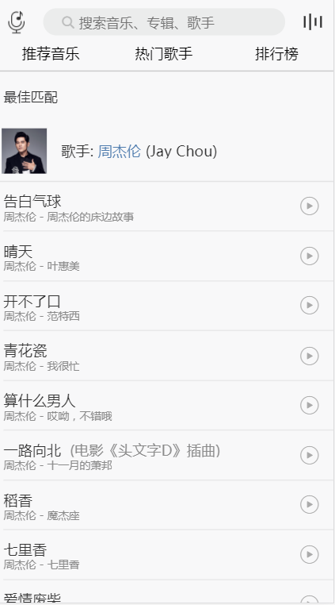
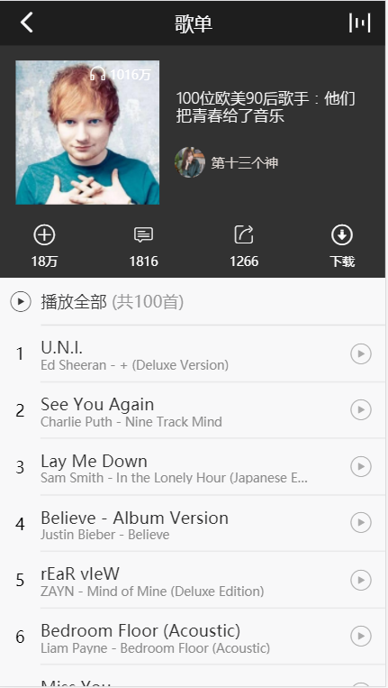
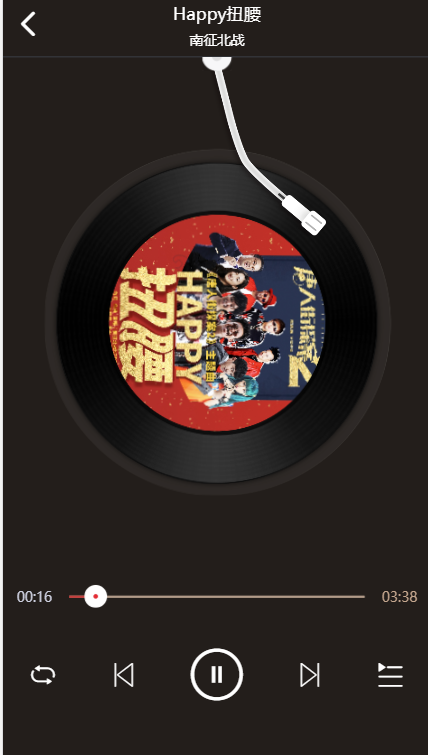

### 项目介绍

此项目个人独立完成，采用网易云音乐os客户端和web端的UI设计，完成首页，歌手页，排行榜，搜索页，歌手详情页，歌单详情页，播放器等页面。后端数据采用网易云音乐线上Api，较完整的实现各个功能

--------------------------------------

###技术栈
react + redux + react-router + webpack + ES6 + sass + flex
---------------------


> 感谢[Binaryify](https://github.com/Binaryify) 提供的node版本网易云音乐API，
项目地址 [NeteaseCloudMusicApi](https://github.com/Binaryify/NeteaseCloudMusicApi)


###  项目运行

运行前请移步项目[NeteaseCloudMusicApi](https://github.com/Binaryify/NeteaseCloudMusicApi)，并运行项目，提供后端API
 
 #### 克隆项目
```
 git clone https://github.com/zbhgit/my-music.git

cd my-music

yarn 

```
#### 运行项目

```
 yarn start
// 浏览器自动打开预览地址
```

#### build线上版本

`yarn build` 自动生成build目录 

###  前端项目请求后端API时发生跨域限制的处理方法

1. 此项目基于create-react-app，可以在package.json中添加
`"proxy": "http://localhost:4000"`

可以换成自己的API地址，[详细参考](https://github.com/facebookincubator/create-react-app/blob/master/packages/react-scripts/template/README.md#proxying-api-requests-in-development)

2. 此项目中使用的后端api 可以进行跨域设置，即采用CORS进行跨域。
相关后端代码
```
// express 项目代码，设置响应头
app.all('*', function (req, res, next) {
  if (req.path !== '/' && !req.path.includes('.')) {
    res.header('Access-Control-Allow-Credentials', true)
    // 这里获取 origin 请求头 而不是用 *
     res.header('Access-Control-Allow-Origin',req.headers['origin']||'*')
     res.header('Access-Control-Allow-Headers', 'X-Requested-With')
     res.header('Access-Control-Allow-Methods', 'PUT,POST,GET,DELETE,OPTIONS')
     res.header('Content-Type', 'application/json;charset=utf-8')
  }
   next()
 })
```
-----------------------------------------------------------------
###  效果演示

> PC 线上地址[DEMO](www.zhangbinhe.com) [防止域名备案限制](114.67.225.219)

-------------------------------------

#### 项目说明

目前再PC上正常流畅展示各项功能，移动端尚可运行，时间比较紧，未做太多兼容处理。

后期会添加详细注释，添加更多页面和功能，只要后端API稳定，会慢慢增加项目的可读性，健壮性。
有时间会写一个文字教程，使自己对react，js有更深的了解

------------------------------

### 最后附上 简单演示图

1. 首页




2. 歌手页



3. 排行榜




4. 搜索页




5 歌手详情页


6.歌单详情页



7. 播放器页面


